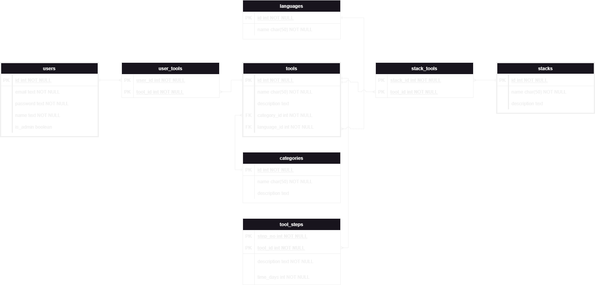
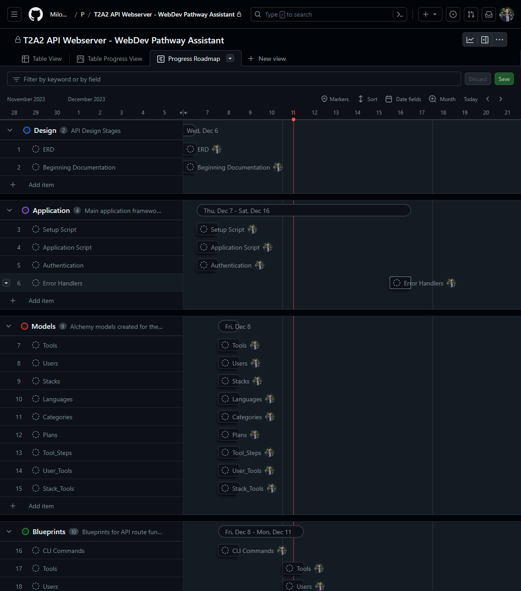
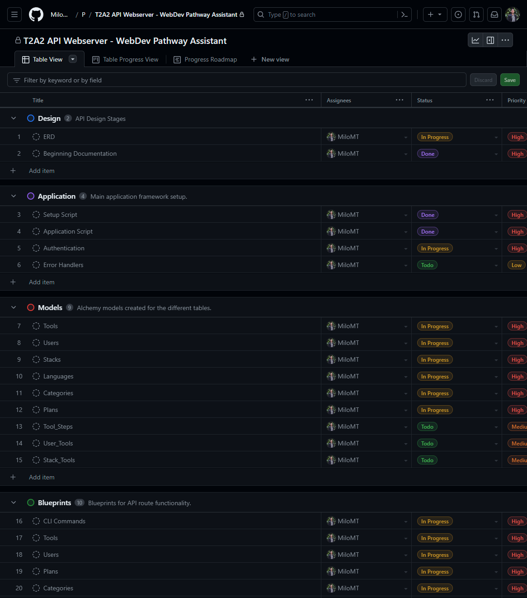

# T2A2 - API Webserver Project

[Github Repository](https://github.com/MiloMT/WebDev-Pathway-Assistant)  
[Github Project](https://github.com/users/MiloMT/projects/3)

## Problem Definition

When beginning a learning journey in web development, there are innumerable resources, tools and pathways a person can use and undergo. This can lodge individuals in a state of indecision when trying to navigate the best way to learn. Not only this, but the information surrounding tooling in web development is spread across a variety of sources, making it difficult to track down information about the variety of tools available and enlarging the task of effective learning.

## Problem Reasoning

This problem creates a lack of clarity surrounding the learning process in web development. This can cause anxiety, lost time and effort and a lack of direction for those wishing to develop their skills further in this field.

This API intends to remedy the above by creating a single source of truth that users can utilise to plan their learning approach to web development. It contains information on a variety of web development tools and the tech stacks that utilise these tools. It can also generate a learning plan based on the users needs, and provide suggestions on time frames for users to dedicate to the task.

## Database Selection


## ORM


## End Points

### /categories

- HTTP Request Verb: ```GET```
- Required Data: null
- Expected Response: A '200 OK' response with a JSON.
- Authentication: null
- Description: Provides a JSON containing the names, IDs and descriptions of all categories within the table.

> Example Response

```json
[
	{
		"description": "A framework",
		"id": 1,
		"name": "Framework"
	},
	{
		"description": "A tool",
		"id": 2,
		"name": "Tool"
	},
	{
		"description": "A software",
		"id": 3,
		"name": "Software"
	}
]
```

- HTTP Request Verb: ```POST```
- Required Data: name (string(50), required), description (text)
- Expected Response: A '201 CREATED' response with a JSON.
- Authentication: Valid JWT Token from an administrator user required.
- Description: Allows an admin to create a new category in the categories table and returns a JSON of the name, ID and description of the created category.

> Example Request

```json
{
	"name":"Created Category",
	"description":"Created Category Description"
}
```

> Example Response

```json
{
	"description": "Created Category Description",
	"id": 4,
	"name": "Created Category"
}
```

#### /categories/\<id> 

- HTTP Request Verb: ```GET```
- Required Data: null
- Expected Response: A '200 OK' response with a JSON.
- Authentication: null
- Description: Provides a JSON containing the name, ID and description of a single category.

> Example Response

```json
{
	"description": "A framework",
	"id": 1,
	"name": "Framework"
}
```

- HTTP Request Verb: ```PUT``` ```PATCH```
- Required Data: name (char(50)), description (text) *missing fields will default to current data*
- Expected Response: A '200 OK' response with a JSON.
- Authentication: Valid JWT Token from an administrator user required.
- Description: Allows an admin to make adjustments to fields from an existing category and returns a JSON of the updated name, ID and description of the affected category.

> Example Request

```json
{
	"name":"Category Changed",
	"description":"Changed Description"
}
```

> Example Response

```json
{
	"description": "Changed Description",
	"id": 1,
	"name": "Category Changed"
}
```

- HTTP Request Verb: ```DELETE```
- Required Data: null
- Expected Response: A '200 OK' response with a JSON.
- Authentication: Valid JWT Token from an administrator user required.
- Description: Allows an admin to delete single categories, provided there are no dependencies related to that category, and returns a JSON confirming the name of the category that has been deleted.

> Example Response

```json
{
	"status": "Created Category has been deleted"
}
```

### /languages  

- HTTP Request Verb: ```GET```
- Required Data: null
- Expected Response: A '200 OK' response with a JSON.
- Authentication: null
- Description: Provides a JSON containing the names and IDs of all languages within the table.

> Example Response

```json
[
	{
		"id": 1,
		"name": "Python"
	},
	{
		"id": 2,
		"name": "Javascript"
	},
	{
		"id": 3,
		"name": "C#"
	}
]
```

- HTTP Request Verb: ```POST```
- Required Data: name (string(50))
- Expected Response: A '201 CREATED' response with a JSON.
- Authentication: Valid JWT Token from an administrator user required.
- Description: Allows an admin to create a new language in the languages table and returns a JSON with the ID and name of the created language.

> Example Request

```json
{
	"name":"Test Language"
}
```

> Example Response

```json
{
	"id": 4,
	"name": "Test Language"
}
```

#### /languages/\<id>  

- HTTP Request Verb: ```GET```
- Required Data: null
- Expected Response: A '200 OK' response with a JSON.
- Authentication: null
- Description: Provides a JSON containing the name and ID of a single language.

> Example Response

```json
{
	"id": 1,
	"name": "Python"
}
```

- HTTP Request Verb: ```PUT``` ```PATCH```
- Required Data: name (string(50)) *missing fields will default to current data*
- Expected Response: A '200 OK' response with a JSON.
- Authentication: Valid JWT Token from an administrator user required.
- Description: Allows an admin to make adjustments to fields from an existing language and returns a JSON of the updated name and ID of the affected language.

> Example Request

```json
{
	"name":"language Changed"
}
```

> Example Response

```json
{
	"id": 1,
	"name": "language Changed"
}
```

- HTTP Request Verb: ```DELETE```
- Required Data: null
- Expected Response: A '200 OK' response with a JSON.
- Authentication: Valid JWT Token from an administrator user required.
- Description: Allows an admin to delete single languages, provided there are no dependencies related to that language, and returns a JSON confirming the name of the language that has been deleted.

> Example Response

```json
{
	"status": "Test Language has been deleted"
}
```

### /stacks  

- HTTP Request Verb: ```GET```
- Required Data: null
- Expected Response: A '200 OK' response with a JSON.
- Authentication: null
- Description: Provides a JSON containing the names, IDs and descriptions of all stacks within the table.

> Example Response

```json
[
	{
		"description": "Stack 1",
		"id": 1,
		"name": "Stack 1"
	},
	{
		"description": "Stack 2",
		"id": 2,
		"name": "Stack 2"
	},
	{
		"description": "Stack 3",
		"id": 3,
		"name": "Stack 3"
	}
]
```

- HTTP Request Verb: ```POST```
- Required Data: name (string(50)), description (text)
- Expected Response: A '201 CREATED' response with a JSON.
- Authentication: Valid JWT Token from an administrator user required.
- Description: Allows an admin to create a new stack in the stacks table and returns a JSON with the ID and name of the created language.

> Example Request

```json
{
	"name":"New Stack",
	"description": "New Stack descriptions"
}
```

> Example Response

```json
{
	"description": "New Stack descriptions",
	"id": 4,
	"name": "New Stack"
}
```

#### /stacks/\<id>  

- HTTP Request Verb: ```GET```
- Required Data: null
- Expected Response: A '200 OK' response with a JSON.
- Authentication: null
- Description: Provides a JSON containing the name, ID and description of a single stack.

> Example Response

```json
{
	"description": "Stack 1",
	"id": 1,
	"name": "Stack 1"
}
```

- HTTP Request Verb: ```PUT``` ```PATCH```
- Required Data: name (string(50)), description (text) *missing fields will default to current data*
- Expected Response: A '200 OK' response with a JSON.
- Authentication: Valid JWT Token from an administrator user required.
- Description: Allows an admin to make adjustments to fields from an existing stack and returns a JSON of the updated name, ID and description of the affected stack.

> Example Request

```json
{
	"name":"Changed Stack",
	"description": "Changed Stack description"
}
```

> Example Response

```json
{
	"description": "Changed Stack description",
	"id": 1,
	"name": "Changed Stack"
}
```

- HTTP Request Verb: ```DELETE```
- Required Data: null
- Expected Response: A '200 OK' response with a JSON.
- Authentication: Valid JWT Token from an administrator user required.
- Description: Allows an admin to delete single stacks, provided there are no dependencies related to that stack, and returns a JSON confirming the name of the stack that has been deleted.

> Example Response

```json
{
	"status": "New Stack has been deleted"
}
```

#### /stacks/\<id>/tools  

- HTTP Request Verb: ```GET```
- Required Data: null
- Expected Response: A '200 OK' response with a JSON.
- Authentication: null
- Description: Provides a JSON containing the names and IDs of all tools related to a single stack.

> Example Response

```json
[
	{
		"tool": {
			"id": 1,
			"name": "Tool 1"
		}
	},
	{
		"tool": {
			"id": 2,
			"name": "Tool 2"
		}
	},
	{
		"tool": {
			"id": 3,
			"name": "Tool 3"
		}
	}
]
```

- HTTP Request Verb: ```POST```
- Required Data: tool.id (int, foreign key, in a nested dictionary)
- Expected Response: A '201 CREATED' response with a JSON.
- Authentication: Valid JWT Token from an administrator user required.
- Description: Provides a JSON containing the names and ID of the tool that has been added to the stack.

> Example Request

```json
{
	"tool": {
		"id": "3"
	}
}
```

> Example Response

```json
{
	"tool": {
		"id": 3,
		"name": "Tool 3"
	}
}
```

#### /stacks/\<id>/tools/\<id>  


- HTTP Request Verb: ```DELETE```
- Required Data: null
- Expected Response: A '200 OK' response with a JSON.
- Authentication: Valid JWT Token from an administrator user required.
- Description: Allows an admin to delete single tools from stacks, and returns a JSON confirming the name of the tool that has been deleted from the relevant stack.

> Example Response

```json
{
	"status": "Tool 3 has been removed"
}
```

### /tools 

- HTTP Request Verb: ```GET```
- Required Data: null
- Expected Response: A '200 OK' response with a JSON.
- Authentication: null
- Description: Provides a JSON containing the names, IDs and descriptions of tools within the table as well as their relevant category name and language name.

> Example Response

```json
[
	{
		"category": {
			"name": "Framework"
		},
		"description": "Tool 1",
		"id": 1,
		"language": {
			"name": "Python"
		},
		"name": "Tool 1"
	},
	{
		"category": {
			"name": "Tool"
		},
		"description": "Tool 2",
		"id": 2,
		"language": {
			"name": "Javascript"
		},
		"name": "Tool 2"
	},
	{
		"category": {
			"name": "Software"
		},
		"description": "Tool 3",
		"id": 3,
		"language": {
			"name": "C#"
		},
		"name": "Tool 3"
	}
]
```

- HTTP Request Verb: ```POST```
- Required Data: name (string(50)), description (text), category.id (int, foreign key, in a nested dictionary), language.id (int, foreign key, in a nested dictionary)
- Expected Response: A '201 CREATED' response with a JSON.
- Authentication: Valid JWT Token from an administrator user required.
- Description: Allows an admin to create a new tool in the tools table and returns a JSON with the ID, name and description of the created tool along with the relevant category and language names.

> Example Request

```json
{
	"name": "Created Tool",
	"description": "Created Tool description",
	"category": {
		"id": "1"
	},
	"language": {
		"id": "1"
	}
}
```

> Example Response

```json
{
	"category": {
		"name": "Framework"
	},
	"description": "Created Tool description",
	"id": 4,
	"language": {
		"name": "Python"
	},
	"name": "Created Tool"
}
```

#### /tools/\<id>  

- HTTP Request Verb: ```GET```
- Required Data: null
- Expected Response: A '200 OK' response with a JSON.
- Authentication: null
- Description: Provides a JSON containing the name, ID and description of a single tool as well as their relevant category name and language name.

> Example Response

```json
{
	"category": {
		"name": "Framework"
	},
	"description": "Tool 1",
	"id": 1,
	"language": {
		"name": "Python"
	},
	"name": "Tool 1"
}
```

- HTTP Request Verb: ```PUT``` ```PATCH```
- Required Data: name (string(50)), description (text), category.id (int, foreign key, in a nested dictionary), language.id (int, foreign key, in a nested dictionary) *missing fields will default to current data*
- Expected Response: A '200 OK' response with a JSON.
- Authentication: Valid JWT Token from an administrator user required.
- Description: Allows an admin to make adjustments to fields from an existing tool and returns a JSON of the updated name, ID and description of the affected stack along with the relevant category and language name.

> Example Request

```json
{
	"name": "Changed Tool Name",
	"description": "Changed tool description",
	"category": {
		"id": "2"
	},
	"language": {
		"id": "2"
	}
}
```

> Example Response

```json
{
	"category": {
		"name": "Tool"
	},
	"description": "Changed tool description",
	"id": 1,
	"language": {
		"name": "Javascript"
	},
	"name": "Changed Tool Name"
}
```

- HTTP Request Verb: ```DELETE```
- Required Data: null
- Expected Response: A '200 OK' response with a JSON.
- Authentication: Valid JWT Token from an administrator user required.
- Description: Allows an admin to delete a single tool, and returns a JSON confirming the name of the tool that has been deleted.

> Example Response

```json
{
	"status": "Created Tool has been deleted"
}
```

#### /tools/\<id>/steps  

- HTTP Request Verb: ```GET```
- Required Data: null
- Expected Response: A '200 OK' response with a JSON.
- Authentication: null
- Description: Provides a JSON containing the description, step number and learning length in days of the tool steps from a single tool.

> Example Response

```json
[
	{
		"description": "The first step",
		"step_no": 1,
		"time_days": 2
	},
	{
		"description": "The second step",
		"step_no": 2,
		"time_days": 1
	},
	{
		"description": "The second step",
		"step_no": 3,
		"time_days": 3
	}
]
```

- HTTP Request Verb: ```POST```
- Required Data: step_no (int), description (text), time_days (int)
- Expected Response: A '201 CREATED' response with a JSON.
- Authentication: Valid JWT Token from an administrator user required.
- Description: Allows an admin to create a new tool step in the tool steps table and returns a JSON with the containing the description, step number and learning length in days of the created tool step.

> Example Request

```json
{
	"step_no": "10",
	"description": "Created Tool Step",
	"time_days": "5"
}
```

> Example Response

```json
{
	"description": "Created Tool Step",
	"step_no": 10,
	"time_days": 5
}
```

#### /tools/\<id>/steps/\<id>  

- HTTP Request Verb: ```GET```
- Required Data: null
- Expected Response: A '200 OK' response with a JSON.
- Authentication: null
- Description: Provides a JSON containing the description, step number and learning length in days of a single tool step.

> Example Response

```json
{
	"description": "The first step",
	"step_no": 1,
	"time_days": 2
}
```

- HTTP Request Verb: ```PUT``` ```PATCH```
- Required Data: step_no (int), description (text), time_days (int) *missing fields will default to current data*
- Expected Response: A '200 OK' response with a JSON.
- Authentication: Valid JWT Token from an administrator user required.
- Description: Allows an admin to make adjustments to fields from an existing tool step and returns a JSON of the updated description, step number and learning length in days of the created tool step.

> Example Request

```json
{
	"step_no": "20",
	"description": "adjusted step",
	"time_days": "10"
}
```

> Example Response

```json
{
	"description": "adjusted step",
	"step_no": 20,
	"time_days": 10
}
```

- HTTP Request Verb: ```DELETE```
- Required Data: null
- Expected Response: A '200 OK' response with a JSON.
- Authentication: Valid JWT Token from an administrator user required.
- Description: Allows an admin to delete a single tool step, and returns a JSON confirming the step number of the tool step that has been deleted.

> Example Response

```json
{
	"status": "Tool Step 10 has been deleted"
}
```

### /users  

- HTTP Request Verb: ```GET```
- Required Data: null
- Expected Response: A '200 OK' response with a JSON.
- Authentication: Valid JWT Token from an administrator user required.
- Description: Allows an admin to request a JSON containing the names, IDs, emails and admin status of all users within the table.

> Example Response

```json
[
	{
		"email": "admin@test.com",
		"id": 1,
		"is_admin": true,
		"name": "Admin User"
	},
	{
		"email": "test@test.com",
		"id": 2,
		"is_admin": false,
		"name": "Test User"
	}
]
```

- HTTP Request Verb: ```POST```
- Required Data: email (text), password (text), name (text)
- Expected Response: A '201 CREATED' response with a JSON.
- Authentication: null
- Description: Allows any user to create a new user in the users table and returns a JSON with the ID, name and email of the created user.

> Example Request

```json
{
	"name":"Created User",
	"email": "user@test.com",
	"password": "password123"
}
```

> Example Response

```json
{
	"email": "user@test.com",
	"id": 3,
	"name": "Created User"
}
```

#### /users/login  

- HTTP Request Verb: ```POST```
- Required Data: email (text), password (text)
- Expected Response: A '201 CREATED' response with a JSON.
- Authentication: null
- Description: Allows a user to login using their email and password and retrieve a JSON containing a valid JWT token for authentication as well as the users email, ID and name as confirmation.

> Example Request

```json
{
	"email": "test@test.com",
	"password": "password"
}
```

> Example Response

```json
{
	"token": "example JWT token",
	"user": {
		"email": "test@test.com",
		"id": 2,
		"name": "Test User"
	}
}
```

#### /users/\<id>  

- HTTP Request Verb: ```GET```
- Required Data: null
- Expected Response: A '200 OK' response with a JSON.
- Authentication: Valid JWT Token from an administrator user required or a valid JWT token from the relevant user.
- Description: Provides a JSON containing the name, ID and email of a single user.

> Example Response

```json
{
	"email": "admin@test.com",
	"id": 1,
	"name": "Admin User"
}
```

- HTTP Request Verb: ```PUT``` ```PATCH```
- Required Data: email (text), password (text), name (text), is_admin (boolean, requires admin privledges to set, requires either a "True" or "False" string) *missing fields will default to current data*
- Expected Response: A '200 OK' response with a JSON.
- Authentication: Valid JWT Token from an administrator user required or a valid JWT token from the relevant user. Admin rights required to update administrator status.
- Description: Allows a user to update their details, and if they have administrator privledges, can adjust the is_admin property of users. Returns a JSON of the updated status including email, ID, and name. If the is_admin property was adjusted, will include it in the returned JSON.

> Example Request (non-admin)

```json
{
	"name":"changed user",
	"email": "test12345@test.com",
	"password": "changedpassword"
}
```

> Example Response (non-admin)

```json
{
	"email": "test12345@test.com",
	"id": 3,
	"name": "changed user"
}
```

> Example Request (admin)

```json
{
	"name":"changed user",
	"email": "test12345@test.com",
	"password": "changedpassword",
	"is_admin": "true"
}
```

> Example Response (admin)

```json
{
	"email": "test12345@test.com",
	"id": 3,
	"is_admin": true,
	"name": "changed user"
}
```

- HTTP Request Verb: ```DELETE```
- Required Data: null
- Expected Response: A '200 OK' response with a JSON.
- Authentication: Valid JWT Token from an administrator user required or a valid JWT token from the relevant user.
- Description: Allows an admin to delete a user from the users table or the relevant user to delete their user from the users table, and returns a JSON confirming the name of the user that has been deleted.

> Example Response

```json
{
	"status": "changed user has been deleted"
}
```

#### /users/\<id>/tools  

- HTTP Request Verb: ```GET```
- Required Data: null
- Expected Response: A '200 OK' response with a JSON.
- Authentication: Valid JWT Token from an administrator user required or a valid JWT token from the relevant user.
- Description: Provides a JSON containing the name and ID of all tools related to a single user.

> Example Response

```json
[
	{
		"tool": {
			"id": 1,
			"name": "Tool 1"
		}
	},
	{
		"tool": {
			"id": 2,
			"name": "Tool 2"
		}
	},
	{
		"tool": {
			"id": 3,
			"name": "Tool 3"
		}
	}
]
```

- HTTP Request Verb: ```POST```
- Required Data: tool.id (int, foreign key, in a nested dictionary)
- Expected Response: A '201 CREATED' response with a JSON.
- Authentication: Valid JWT Token from an administrator user required or a valid JWT token from the relevant user.
- Description: Allows an admin to add a tool to a users account or the relevant user to add a tool to their own account, returns a JSON with the added tool's ID and name.

> Example Request

```json
{
	"tool": {
		"id": 3
	}
}
```

> Example Response

```json
{
	"tool": {
		"id": 3,
		"name": "Tool 3"
	}
}
```

#### /users/\<id>/tools/\<id>

- HTTP Request Verb: ```DELETE```
- Required Data: null
- Expected Response: A '200 OK' response with a JSON.
- Authentication: Valid JWT Token from an administrator user required or a valid JWT token from the relevant user.
- Description: Allows an admin to remove a tool from a user or the relevant user to remove a tool from their user, and returns a JSON confirming the name of the tool that has been removed.

> Example Response

```json
{
	"status": "Tool 1 has been removed"
}
```

## ERD



## Third Party Services


## Model Relationships

#### Summation

There are three main models that act as the backbone to this API, that is: Tool, Stack and User. Each of the other resources are designed to contribute to these three combined with two join tables that act as a link between these major models.

#### Tool Model

The tool model contains it's own information in the form of an ID for a primary key, a name and a description as a tool can be only apart of one category and one language at any one time. This model also contains two foreign keys attached to the models 'Categories' and 'Languages'. These foreign keys are used so that each tool can be defined in conjunction with categories and languages, which both can be related to multiple records within the tools table. So each of these follow a one to many relationship from the tools to the categories and languages. Outside of this, the tools model is used as a foreign key / conjoined primary key in the tool_steps model as one tool can have multiple steps forming a one to many relationship from tools to tool_steps. Lastly, the tools model is attached to two join tables, both user_tools and stack_tools, to provide the functionality of a many to many relationship between the three major models through a one to many relationship to the join table from both ends. As with the tool_steps model, each of the join models uses the tools ID within their primary key, allowing for efficient routing for correct information.

Due to the back_populating in the tool model, the tool schema has access to information about related categories, languages and tool_steps.

```python
class Tool(db.Model):
    __tablename__ = "tools"

    id = db.Column(db.Integer, primary_key=True)
    
    name = db.Column(db.String(50), unique=True)
    description = db.Column(db.Text, nullable=False)
    
    category_id = db.Column(
        db.Integer, db.ForeignKey("categories.id"), nullable=False
        )
    category = db.relationship("Category", back_populates="tools")
    
    language_id = db.Column(
        db.Integer, db.ForeignKey("languages.id"), nullable=False
        )
    language = db.relationship("Language", back_populates="tools")
    
    tool_steps = db.relationship("Tool_Step", back_populates="tool")
    stack_tools = db.relationship("Stack_Tool", back_populates="tool")
    user_tools = db.relationship("User_Tool", back_populates="tool")

```

#### Category Model

The categories model is very straight forward, it contains an ID for a primary key, and a name and description. There are no foreign keys contained within the categories model, however as mentioned above, the tools model makes use of the category ID as a foreign key link between the two models in a one to many relationship.

Due to the back_populating in the category model, the category could have access to related tools, however the descision was made that this relationship wouldn't logically make sense and so wasn't included.

```python
class Category(db.Model):
    __tablename__ = "categories"

    id = db.Column(db.Integer, primary_key=True)
    
    name = db.Column(db.String(50), nullable=False, unique=True)
    description = db.Column(db.Text)
    
    tools = db.relationship("Tool", back_populates="category")
```

#### Language Model

As with the categories model, the languages model is very straight forward, it contains an ID for a primary key and a name. There are no foreign keys contained within the languages model, however as mentioned above, the tools model makes use of the language ID as a foreign key link between the two models in a one to many relationship.

Due to the back_populating in the language model, the language could have access to related tools, however the descision was made that this relationship wouldn't logically make sense and so wasn't included.

```python
class Language(db.Model):
    __tablename__ = "languages"

    id = db.Column(db.Integer, primary_key=True)
    
    name = db.Column(db.String(50), nullable=False, unique=True)
    
    tools = db.relationship("Tool", back_populates="language")
```

#### Tool_Step Model

The tool step model is the first of the models discussed to contain a joined primary key as tools can have multiple steps. As the tool_steps entries acts as a sub-resource for the tools, this joined primary key makes evident this relationship. The primary key consists of two fields, the step_no which is a straight integer field, and the tool_id which is a foreign key from the tools model in a many to one relationship from tool_steps to tools. Lastly, it also contains two other fields in the description and time_days to account for other required information.

Due to the back_populating in the tool_step model, the tool_step schema has access to information about related the related tool.

```python
class Tool_Step(db.Model):
    __tablename__ = "tool_steps"
    
    step_no = db.Column(db.Integer, nullable=False)
    description = db.Column(db.Text, nullable=False)
    time_days = db.Column(db.Integer, nullable=False)
    
    tool_id = db.Column(db.Integer, db.ForeignKey("tools.id"), nullable=False)
    tool = db.relationship("Tool", back_populates="tool_steps")
    
    __table_args__ = (
        db.PrimaryKeyConstraint(
            tool_id, step_no,
        ),
    )
```

#### User Model

The second of the major models, the users model allows information about the tools to be associated with a given user. The model itself contains the ID as a primary key, and also an email field, a password, a name and is_admin to form the administrator privledges status. No foreign keys are contained within this model, however this model forms a one to many relationship with the user_tools joint able to link users to tools. This user model has it's primary key joined from the user_id and the tool_id and the routing logically uses the user_tools as a subresource for users through the 'user/user id/tools' end points.

Due to the back_populating in the user model, the user schema has access to information about known tools through the join table.

```python
class User(db.Model):
    __tablename__ = "users"

    id = db.Column(db.Integer, primary_key=True)
    
    email = db.Column(db.Text, nullable=False, unique=True)
    password = db.Column(db.Text, nullable=False)
    name = db.Column(db.Text, default="Anonymous")
    is_admin = db.Column(db.Boolean, default=False)
    
    user_tools = db.relationship("User_Tool", back_populates="user")
```

#### User_Tool Model

As discussed above, the user_tool model is a join table to allow a relationship between the users and tools models as a user can know multiple tools, and tools can be known by multiple users. Both of it's fields are foreign keys taken from the ID of each of these major models, and these form the primary key to emphasise the relationship between the users and the tools. This model forms a many to one relationship to both the users and the tools models.

Due to the back_populating in the user_tool model, the user_tool schema has access to information about both the relevant user and the relevant tool.

```python
class User_Tool(db.Model):
    __tablename__ = "user_tools"
    
    user_id = db.Column(db.Integer, db.ForeignKey("users.id"), nullable=False)
    user = db.relationship("User", back_populates="user_tools")
    
    tool_id = db.Column(db.Integer, db.ForeignKey("tools.id"), nullable=False)
    tool = db.relationship("Tool", back_populates="user_tools")
    
    __table_args__ = (
        db.PrimaryKeyConstraint(
            user_id, tool_id,
        ),
    )
```

#### Stack Model

The last of the major models with a smaller amount of information. It contains an ID for the primary key, a name and a description. There are no foreign keys directly in the model however it forms a one to many relationship to the stack_tools model similar to the relationship between users and user_tools. The stack_tools is also treated as a subresource of stacks so that the tools associated to a stack can be easily obtained through the 'stacks/stack id/tools' end points.

Due to the back_populating in the stack model, the stack schema has access to information about the relevant tools through the join table.

```python
class Stack(db.Model):
    __tablename__ = "stacks"

    id = db.Column(db.Integer, primary_key=True)
    
    name = db.Column(db.String(50), unique=True)
    description = db.Column(db.Text, nullable=False)
    
    stack_tools = db.relationship("Stack_Tool", back_populates="stack")
```

#### Stack_Tool Model

Lastly, the stack_tool model is a join table to allow a relationship between the stacks and tools models as stacks can be made from multiple tools, and tools can be apart of multiple stacks. Both of it's fields are foreign keys taken from the ID of each of these major models, and these form the primary key to emphasise the relationship between the stacks and the tools. This model forms a many to one relationship to both the stacks and the tools models.

Due to the back_populating in the stack_tool model, the stack_tool schema has access to information about both the relevant stack and the relevant tool.

```python
class Stack_Tool(db.Model):
    __tablename__ = "stack_tools"
    
    stack_id = db.Column(db.Integer, db.ForeignKey("stacks.id"), nullable=False)
    stack = db.relationship("Stack", back_populates="stack_tools")
    
    tool_id = db.Column(db.Integer, db.ForeignKey("tools.id"), nullable=False)
    tool = db.relationship("Tool", back_populates="stack_tools")
    
    __table_args__ = (
        db.PrimaryKeyConstraint(
            stack_id, tool_id,
        ),
    )
```

## Database Relations

The database is created with PostgreSQL for this particular project. In order to create the database and tables, CLI commands have been created through the CLI BP in order to create and than seed these tables. Due to the dependencies between each of the tables, the seed command seeds the database in the following order to ensure entries are created prior to the assignment of foreign keys and creation of relationships:

- Categories
- Languages
- Stacks
- Tools
- Tool_Steps
- Users
- Stack_Tools
- User_Tools

The database creates the relationships in the following ways:

- The tools table forms the most complex structure, containing a primary key, two standard fields and two foreign keys (both integer types) linking to the ID fields of the both the languages and categories tables. The ID is a sequential index that is automatically incremented and applied as new tools are added. New tools form new records within this table, bearing in mind that in order to create a new tool, the relevant category and language needs to be created in their respective tables prior to ensure the foreign keys are valid.
- The categories table is a simple table that contains just an ID, a name and a description. The ID forms the primary key and is a sequential index incremented and applied as new categories are added.
- The languages table is a simple table that contains just an ID and a name. The ID forms the primary key and is a sequential index incremented and applied as new languages are added.
- The tool_steps table contains a primary key joined from two fields, the 'step_no' which is a custom integer field and a foreign key which contains a tool_id reference from the tools table. The table also contains fields for both a description and time_days and seperate fields. The joined primary key has been chosing here to emphasise the relationship between the main resource (the tools table) and the subresource (the tool_steps table) and the dependency that exists between them. Each tool can have many steps, but a single tool can't have duplicate steps in the form of a step_no integer, and this primary key enforces that automatically.
- The user table forms a fairly simple structure with an ID for the primary key which is a sequential index incremented and applied as new users are added. There are also fields for an email, a password, a name and an is_admin field used for admin privledge authorization. There are no foreign keys contained directly within the user table, however it acts as the main resource for the user_tools described below.
- The user_tools table forms a join table to cement the relationship between the users table and the tools table. It's primary key is a joined key made from two foreign key fields, both the user_id and the tool_id. These two fields are the only fields existing in this table, and their sole purpose is to link user records to tool records from these two tables. Neither of these fields are sequential index's as the foreign key relies on existing entries within the other tables, and this format for the primary key enforces that logic. The user_tools table acts as a subresource of the users table to follow a logical approach of looking through the route of the user first to access the tools that are listed under a given user. 
- The stacks table is the last main resource however contains fairly limited information. An ID forms the primary key which is a sequential index incremented and applied as new stacks are added. Outside of that, the other fields area name and a description field. Similar in structure to users, this table forms a main resource / sub-resource relation to the stack_tools table so that tools related to a stack can be checked under the stack table routes.
- The stacks_tools table forms a join table to cement the relationship between the stacks table and the tools table. It's primary key is a joined key made from two foreign key fields, both the stack_id and the tool_id. These two fields are the only fields existing in this table, and their sole purpose is to link stacks to tool records from these two tables. Neither of these fields are sequential index's as the foreign key relies on existing entries within the other tables, and this format for the primary key enforces that logic. The stack_tools table acts as a subresource of the stacks table to follow a logical approach of looking through the route of the stack first to access the tools that are listed under a given stack. 

## Project Management

The way this project was managed was through 3 main avenues, Github projects, standups and github commits. 

Github projects formed the base of my project organisation. Each stage was broken up into multiple categories, and than each category was broken up into multiple issues. This allowed me to structure my approach from the get go, and align my project objectives in a structured yet flexible approach. Each task was given a priority to assist in shaping which tasks to tackle first and prioritise my workload appropriately, and a due date to track my project against the overall timeline as well as highlight dependencies within the API, such as models needing to be created before blueprints. Each individual issue was also assigned to a different stage between 'To Do', 'In Progress' and 'Done' that I actively adjusted to suit the appropriate stage of each issue at any given time. New issues were added as required and I could adjust or remove old issues if they were no longer relevant or were needed for project objectives.

Daily standups formed another major part of the project through the coder academy discord channel. Each standup provided the opportunity to provide updated status on how the project delivery was running and whether there were any potential roadblocks throughout the process. This allowed the educators to oversee progress and allowed the opportunity to leverage outside knowledge to efficiently handle roadblocks rather than slow progress through these problems. Although it wouldn't form a part of a professional setting, the comparison of other student standups also allows for reflection on your own progress, and potential ideas on how to approach key problems and issues.

Lastly, github commits form the trackable basis for progress over the length of the assessment. Descriptive naming was given to each of these commits, so that if required rollbacks can be utilised accurately and efficiently, and progress can be tracked across the length of the project and against the Github project.

These three combined create a comprehensive overview of both the initial project planning stage and project delivery throughout the assessment time frame.

> Github Project Screenshot




> Standup Example

```
1. Finished the majority of CRUD operations, figured out join tables and how to add records to join tables with conjoined primary keys.
2. Was figuring out the join table logic and join table requests, but figured out that I needed nested json statements for it.
3. Finalise all my models and try to finish as much of my blueprints as possible.
4. How to pass and parse nested jsons
```

> Github Commit History Screenshot


